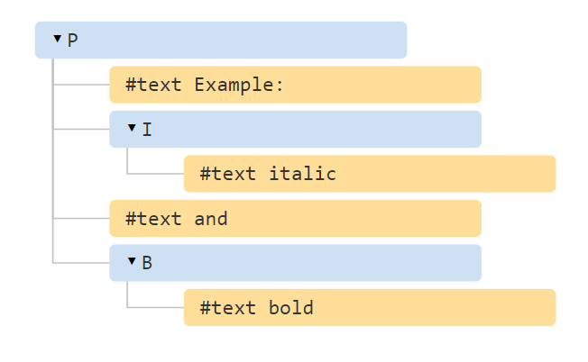
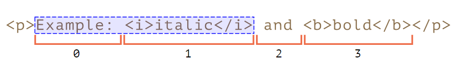
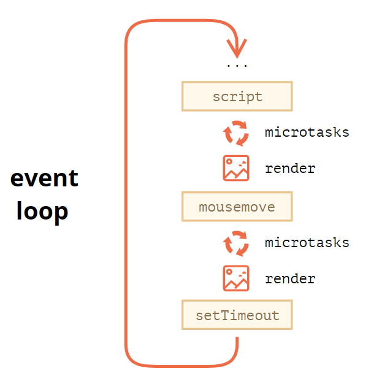

### Mutation observer
`MutationObserver` is a built-in object that `observes a DOM element` and `fires a callback in case of changes`.
It gives you ability to observe the DOM, and make some actions when some element is appeared.

#### Syntax
```js
let observer = new MutationObserver(callback);
observer.observe(node, config);
```
`config` is an object `with boolean options` “what kind of changes to react on”:
* *childList* – changes in the direct children of node;
* *subtree* – in all descendants of node;
* *attributes* – attributes of node;
* *attributeFilter* – an array of attribute names, to observe only selected ones;
* *characterData* – whether to observe node.data (text content);
* *attributeOldValue* – if true, pass both the *old* and the *new* attribute value to callback, otherwise only the
 new one (needs attributes option);
* *characterDataOldValue* – if true, pass both the *old* and the *new* value of node.data to callback, otherwise only
 the new one (needs characterData option).
 
 After changes, the *callback* is executed: changes passed in first argument as a list of **MutationRecord** objects,
 and the **observer** itself as the second argument.
 
 MutationRecord objects have properties:
* type – mutation type, one of
    * "attributes": attribute modified
    * "characterData": data modified, used for text nodes,
    * "childList": child elements added/removed,
* target – node where the change occurred: an *element* for "attributes", or *text node* for "characterData",
 or an *element* for a "childList" mutation,
* addedNodes/removedNodes – nodes that were added/removed,
* previousSibling/nextSibling – the previous and next sibling to added/removed nodes,
* attributeName/attributeNamespace – the name/namespace (for XML) of the changed attribute,
* oldValue – the previous value, *only for attribute or text changes*, if the corresponding option is set
 attributeOldValue/characterDataOldValue.
 
#### Usage
**Integration** \
e.g. you are using the third-party script that adds div with ads? add a mutation observer to this element, and when it's
appeared - just delete it.

**Architecture** \
Dynamically understands that some node where added and modify them.
```js
let observer = new MutationObserver(mutations => {
  for(let mutation of mutations) {
    // examine new nodes, is there anything to highlight?
    for(let node of mutation.addedNodes) {
      // we track only elements, skip other nodes (e.g. text nodes)
      if (!(node instanceof HTMLElement)) continue;
      // check the inserted element for being a code snippet
      if (node.matches('pre[class*="language-"]')) {
        highlightElement(node);
      }
      // or maybe there's a code snippet somewhere in its subtree?
      for(let elem of node.querySelectorAll('pre[class*="language-"]')) {
        highlightElement(elem);
      }
    }
  }
});
let demoElem = document.getElementById('highlight-demo');
observer.observe(demoElem, {childList: true, subtree: true});
```

#### Additional methods
* observer.disconnect() – stops the observation, after stop - it might be possible that some changes were not processed
by the observer yet.
* observer.takeRecords() – gets a list of unprocessed by callback mutation records.

> Garbage collection doesn't care about an observer, if node where deleted - GC - will clean the memory, no matter that
> observer watching it.

---
### Selection and Range
With JS we can get the existing element or text selection, select/deselect as a whole or partially, remove the selected
part from the document, wrap it into a tag, and so on.

#### Range
[Range](https://dom.spec.whatwg.org/#ranges): basically, a pair of “boundary points”: `range start` and `range end`.

With this html:
```html
<p id="p">Example: <i>italic</i> and <b>bold</b></p>
```
We have this nodes:


With this JS:
```js
let range = new Range();
range.setStart(p, 0);
range.setEnd(p, 2);
// toString of a range returns its content as text (without tags)
console.log(range); // Example: italic
// apply this range for document selection (explained later)
document.getSelection().addRange(range);
```

We can select range:


#### Selection
The fundamental difference is that a `Selection represents` the `user's selection`, while `Range represents` a continuous
`part of a document without any visual representation`. \
The document selection is represented by Selection object, that can be obtained as `window.getSelection()`
or `document.getSelection()`.

The main selection properties are:
* anchorNode – the node where the selection starts,
* anchorOffset – the offset in anchorNode where the selection starts,
* focusNode – the node where the selection ends,
* focusOffset – the offset in focusNode where the selection ends,
* isCollapsed – true if selection selects nothing (empty range), or doesn’t exist.
* rangeCount – count of ranges in the selection, maximum 1 in all browsers except Firefox.

### Event loop: microtasks and macrotasks
##### Event Loop
The general algorithm of the engine:
1. Dequeue and run the oldest task from the macrotask queue (e.g. “script”).
2. Execute all microtasks:
    * While the microtask queue is not empty:
        * Dequeue and run the oldest microtask.
3. Render changes if any.
4. If the macrotask queue is empty, wait till a macrotask appears.
5. Go to step 1.

Tasks:
* When an external script \<script src="..."> loads, the task is to execute it.
* When a user moves their mouse, the task is to dispatch mousemove event and execute handlers.
* When the time is due for a scheduled setTimeout, the task is to run its callback. 
* etc.

If a `task comes while the engine is busy` -> they `goes to queue`, “macrotask queue” (v8 term), "first come - first served"

Couple details:
* Rendering never happens while the engine executes a task. Changes to DOM are painted only after the task is complete.
* If a task takes too long, the browser hangs, and if too long -> “Page Unresponsive” suggesting.

**Splitting CPU-hungry tasks**. Done some measurable job? `add setTimeout` with the next portion - it will set this task 
in the end of the queue, also you can `show the progress` bar with time to time adding part of your big job to setTimeout.
Another useful thing to do - if you want to `execute something after the sync code`, e.g. you need to fire "last event"
but only after previous will bubble up for all needed elements, we can add it to setTimeout, and it will fire after sync
handlers.

#### Macrotasks and Microtasks
Microtasks come from our JS code. Usually created by promises: an execution of .then/catch/finally handler becomes a
microtask. Microtasks are used “under the cover” of await as well, as it’s another form of promise handling. \
Special function `queueMicrotask(func)` that queues func for execution in the microtask queue, helpful if you want to 
do something before rendering but after macrotask. Same as `setTimeout(f)` - to schedule a macrotask.

**Immediately after every _macrotask_, the engine executes _`all tasks` from microtask queue_, prior to running any other
macrotasks or rendering or anything else**

```js
setTimeout(() => console.log("setTimeout macrotask 2")); // macrotask
Promise.resolve().then(() => console.log("microtask")); // microtask
console.log("macrotask 1"); // macrotask
/* Output:
1. macrotask 1;
2. microtask;
3. setTimeout macrotask 2;
*/
```


> **WebWorkers** to rescue. Heavy calculations, and you don't want to block main thread? \
> Running in parallel thread, own variables and event loop, exchange messages with the main process. \
> *But*: Do not have access to DOM, so they are mainly, for calculations, to use multiple CPU cores simultaneously.